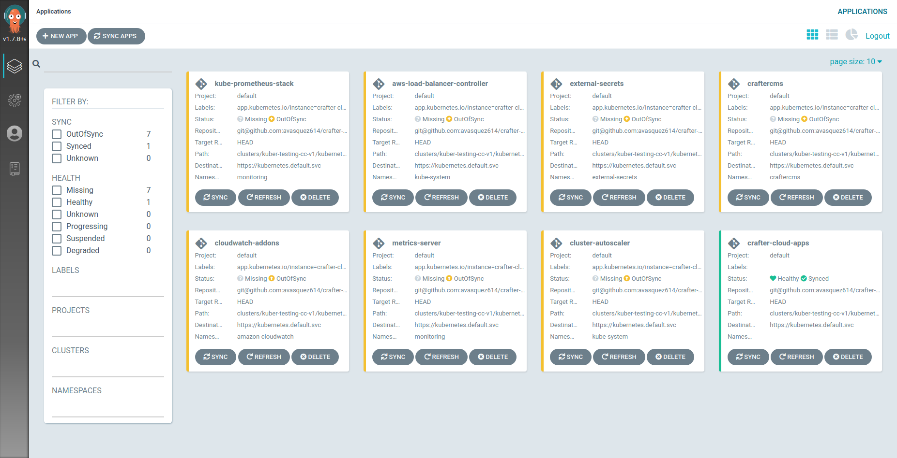

# Crafter Kubernetes Automation Scripts
This project provides scripts to setup an EKS Kubernetes cluster with Crafter CMS. In specific, these scripts:
1. Create an EKS Kubernetes cluster in a AWS region, with it's own VPC.
2. Provision necessary AWS resources external to the cluster (ES domain, AWS Secrets, IAM users, etc.).
3. Install ArgoCD for later deployment of the Crafter CMS Kubernetes resources.

## Pre-requisites

1. Install AWS CLI (https://aws.amazon.com/cli/)
2. Install kubectl (https://kubernetes.io/docs/tasks/tools/install-kubectl/)
3. Install eksctl (https://docs.aws.amazon.com/eks/latest/userguide/eksctl.html)
4. Install k9s (https://github.com/derailed/k9s)
5. Instal kubectx (https://github.com/ahmetb/kubectx)
6. Install jq (https://stedolan.github.io/jq/download/)
7. Create a fork of this repository for the client (e.g. `crafter-aws-tpci`)

## Run the account setup script

**NOTE:** This should only be run once, after the AWS account has been created. Make sure you also have setup an AWS profile in your machine for an IAM user with administrator privileges. 

1. Under `./scripts/account`, copy the `config.sh.off` file to `config.ACC_ID.sh`, replacing `ACC_ID` with a string
representing an identifier for the account. For example, if the client has a separate account for QA resources, then you can name 
the file `config.qa.sh` (`ACC_ID` can be anything you like as long as it's different between accounts). If there's a single account, 
you can leave `ENV` empty (`config.sh`).
2. Open the config file and fill the properties appropiately. You can leave the ones that are auto-generated empty 
and they will be filled by the scripts automatically.
3. AWS_PROFILE should be the AWS profile used to access the resources of the AWS account of the client. It can be setup with `aws --profile CLIENT_PROFILE configure`
4. Run `./scripts/account/setup.sh` and follow the instructions. When being asked for the config.sh suffix, provide
the `ACC_ID` string mentioned aboved.
5. Navigate to the CloudFormation tab in the AWS console to ensure that your stack is being spun up.

## Run the Environment Setup Script

**NOTE:** Should only be run once per environment, when creating the first cluster for the config.

1. Under `./scripts/environments`, copy the `config.sh.off` file to `config.ENV.sh`, replacing `ENV` with a string
representing the environment specific resources. For example, if we're provisioning the resources for the Dev environment, 
then name the file `config.dev.sh`. If there's always going to be a single environment, you can leave `ENV` empty (`config.sh`).
2. Open the config.sh file and fill in the properties approriately. 
3. For the CLIENT_ID section, the first 4/5 letters of the client will be used (For example: Crafter would be either Craf or Craft)
4. Run the `./scripts/environments/setup.sh` script and enter the environment's name when prompted.
5. Navigate to the CloudFormation tab in the AWS console to ensure that your stack is being spun up.

## Create blue and green domain names 
1. Navigate to route-53 in the AWS console and create new domain names for the client. The naming convention is $CLIENT_ID-<blue/green>.net

## Run the Clusters Setup Script

1. Under `./scripts/clusters`, copy the `config.sh.off` file to `config.ENV-(blue|green).sh`, replacing `ENV` with a string
representing the environment of this cluster, and `blue` if it's going to be the main cluster, or `green` if it's cluster that it's going to
be used for testing and will eventually transition to become the `blue` cluster. For example, if this is going to be the Prod `blue` cluster, 
then name the file `config.prod-blue.sh`. If there's always going to be a single environment, you can leave `ENV-(blue|green)` empty (`config.sh`).
2. Open the config.sh file and fill in the properties approriately.
3. For the AWS_AZ sections, the value is $DEFAULT_REGION<a/b/c>
4. For the AWS_BACKUP_REGION, the value is the default region's closest region (us-east-1's DR would be us-east-2) OR the region the client has decided as the backup region in case of disaster recovery.
5. Run the `./scripts/clusters/setup.sh` script and enter the environment's name when prompted.

- Add the Crafter license under `./clusters/{AWS_REGION}/{CLUSTER_NAME}/kubernetes/gitops/apps/main/craftercms/resources/common/secrets/crafter.lic`.

## Install Crafter CMS from ArgoCD

- Make sure you push the cluster back up to the master repository before continuing with this section.
1. In another terminal, start port-forward connection `kubectl port-forward svc/argocd-server -n argocd 18080:443` 
2. Login to ArgoCD at http://localhost:18080 from your browser
3. Click on the gears icon on the left nav bar (Settings), then Repositories.
4. Connect to the repo at `GITOPS_REPO_URL`, either through SSH or HTTPs.
   - **Application Name:** crafter-aws-{CLIENT_NAME}
   - **Project:** default
   - **Repository URL:** URL of the repository you connected to previously
   - **SSH Private key data:** Private key (Given beforehand)
5. Click on `Create`
6. Click on `Sync` and then `Synchronize` in the `crafter-cloud-apps` app. All the Kubernetes addons and the 

7. Commit the change and push it to the repo. Click on the `Refresh` button of `craftercms` app.
8. Click on `Sync` and then `Synchronize` on the `craftercms` app.
9. Get the Authoring LB from `k9s` (by entering `:ingress`), or by running `kubectl -n craftercms get ingress` 
10. Finally enter `http://AUTHORING_LB/studio` in your browser, Studio should appear. You should be able to login 
with `admin/admin`.

That's it! Crafter CMS is up and running in a Kubernetes cluster. Remember to configure the Authoring ingress at
`./clusters/{CLUSTER_NAME}/kubernetes/gitops/apps/craftercms/authoring-deployment.yaml` with and SSL certificate 
in order to allow HTTPS access.

## Requesting Certificates for the new environment

1. Navigate to the AWS console's Certificate Manager
2. Request new Certificate
3. Enter the domain name (`*.craftercloud.io`) (`*.$CLIENT_ID-blue.net`) (`*.$CLIENT_ID-green.net`) - If the client provides their own DNS name for Authoring and Delivery, use that instead of `*.craftercloud.io`
4. Click request
5. Copy the CNAME and CNAME VALUES and place them in the managed services spreadsheet.

## Adding the SSL certificates

1. Navigate to `/clusters/${cluster name}/kubernetes/gitops/apps/main/craftercms/authoring-deployment.yaml`
2. Uncomment the lines that say to uncomment after generating the SSL cert and validating it (15-17)
3. In the ARN section, paste the ARN cert in.
4. Add/Commit/Push/Merge the changes back into the main repository
5. Navigate back to the ArgoCD Application and click the "Refresh" button nuder the craftercms Application once the changes have been merged.
6. After the refresh, Synchronize. This will spin up the authoring and delivery pods
7. Search for the ingress pods in k9s and copy the Addresses for both the authoring and delivery ingresses. Paste them into the Managed Services Spreadsheet.

## Adding new DNS records
1. Navigate to the Route-53 console in the AWS console and create a new record under the hosted zone. Modify the Record type to CNAME.
2. In the sub domain section, add ENV-authoring, where ENV is the environment of the cluster. If it's `.craftercloud.io`, it should be `ENV-authoring-CLIENT_ID.craftercloud.io`
3. Repeat the same for Delivery. 

## Creating temporary site and publishing
1. Navigate to studio
2. Create a new empty site
3. Publish the home page